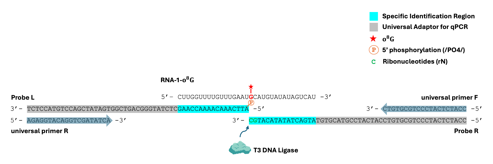

# Site-Specific Oxidized miRNA Probe Designer

Site-Specific Oxidized miRNA Probe Designer is a transparent, rule-based Python tool for designing paired oligonucleotide probes for ligase-dependent detection of site-specific oxidized miRNA targets. It accepts a miRNA sequence in RNA `5'->3'` orientation plus a user-specified oxidized guanine position, then returns the corresponding Probe L / Probe R binding regions, assembled probe sequences, and universal primers.

The repository includes both a reusable Python API and a lightweight Streamlit interface for interactive design, inspection, and export.



## Overview

This project is intended for sequence design in ligase-dependent qPCR workflows where a specific oxidized guanine position is already known or being evaluated. The current implementation emphasizes explicit design rules, deterministic output, and copy-friendly reporting rather than heuristic optimization.

The designer:

- treats the input miRNA as RNA written `5'->3'`
- splits the target into left and right probe windows around the oxidized position
- converts each assigned RNA window into a DNA reverse-complement binding sequence
- assembles full Probe L and Probe R oligos using fixed adaptor sequences
- returns universal primer sequences used with the designed probes
- provides a text schematic, downloadable report, and CSV-ready flat output

## Experimental Reference

This repository focuses on probe-sequence design. For the experimental workflow and assay operation details, please refer to the published article:

- Accurate identification of 8-oxoguanine in RNA with single-nucleotide resolution using ligase-dependent qPCR. DOI: [10.1039/D4OB00786G](https://doi.org/10.1039/D4OB00786G)

This tool is intended to support sequence design around that ligase-dependent detection strategy; it does not replace the experimental protocol described in the paper.

## Key Features

- Streamlit web interface for interactive probe design
- Python API for scripted or batch-style use
- Configurable split mode to decide which probe contains the oxidized base
- Optional `/PO4/` display prefix for Probe L ordering output
- Optional display-only `rN` annotation for the terminal two bases of Probe R
- TXT and CSV export from the web app
- Unit tests covering normalization, orientation logic, split behavior, and formatting helpers

## Design Logic

### Orientation conventions

- Input miRNA is interpreted as RNA in `5'->3'` orientation.
- Probe binding regions are reported as DNA oligos in `5'->3'` orientation.
- Each binding region is the DNA reverse complement of its assigned miRNA subsequence.
- The ligated product orientation is defined as `5' - Probe R - Probe L - 3'`.

### Split modes

The tool supports two mutually exclusive split rules:

- `oxidized_base_belongs_to_R`
- `oxidized_base_belongs_to_L`

Together, Probe L and Probe R span the full miRNA with no gap. The split mode only decides which probe contains the oxidized base.

- If the oxidized base belongs to Probe R, Probe L covers positions `1..p-1` and Probe R covers positions `p..N`.
- If the oxidized base belongs to Probe L, Probe L covers positions `1..p` and Probe R covers positions `p+1..N`.

Designs are rejected when either probe would contain zero miRNA-complementary bases.

## Fixed Sequences

- Probe L adaptor: `CTCTATGGGCAGTCGGTGATATCGACCTGTACCTCT`
- Probe R adaptor: `CCATCTCATCCCTGCGTGTCCATCATCCGTACGTGT`
- Universal primer F: `CCATCTCATCCCTGCGTGTC`
- Universal primer R: `AGAGGTACAGGTCGATATCA`

## Inputs And Outputs

### Required inputs

- `mirna_seq`: miRNA sequence written as RNA `5'->3'`
- `oxidized_pos`: 1-based position of the oxidized guanine in the cleaned sequence

### Optional controls

- `split_mode`
- `add_probe_l_phosphate_tag`
- `format_probe_r_last_two_as_rna`

### Main outputs

- cleaned input miRNA sequence
- Probe L target window and RNA subsequence
- Probe R target window and RNA subsequence
- Probe L DNA binding region
- Probe R DNA binding region
- full Probe L sequence
- full Probe R raw sequence
- full Probe R display sequence
- universal primer sequences
- notes, warnings, and a copy-friendly text schematic

## Installation

Use Python `3.11+`.

### Option 1: conda or mamba

```bash
mamba env create -f environment.yml
mamba activate mirna-probe-designer
```

### Option 2: existing Python environment

```bash
python -m pip install -r requirements.txt
```

## Run The Streamlit App

```bash
streamlit run app.py
```

The app lets you:

- enter a miRNA sequence and oxidized position
- choose the split mode
- toggle Probe L `/PO4/` output
- toggle Probe R terminal `rN` display formatting
- review the design schematic and assigned probe windows
- download a TXT report or CSV summary

## Python API Example

```python
from probe_designer import design_probes

result = design_probes(
    mirna_seq="UGAGGUAGUAGGUUGUAUAGUU",
    oxidized_pos=8,
    split_mode="oxidized_base_belongs_to_R",
    add_probe_l_phosphate_tag=True,
    format_probe_r_last_two_as_rna=True,
)

print(result.probe_l_full)
print(result.probe_r_full_display)
print(result.universal_primer_f)
print(result.universal_primer_r)
```

## Run Tests

```bash
python -m unittest discover -s tests -v
```

## Project Structure

```text
.
├── app.py
├── probe_designer/
│   ├── constants.py
│   ├── core.py
│   ├── formatting.py
│   ├── models.py
│   └── utils.py
├── tests/
├── assets/
│   └── Probe_Design_Scheme.png
├── requirements.txt
└── environment.yml
```

## Current Scope And Limitations

This project is intentionally rule-based and does not currently model:

- melting temperature optimization
- mismatch scoring
- ligation efficiency
- secondary structure
- off-target analysis
- broader empirical chemistry constraints beyond the explicit implemented rules

## Citation

If you use this repository in a methods workflow, please cite the related experimental article above and describe this repository as a sequence-design utility for site-specific oxidized miRNA probe generation.
